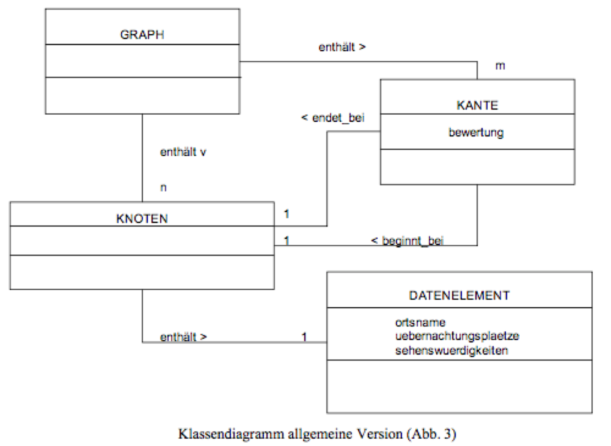
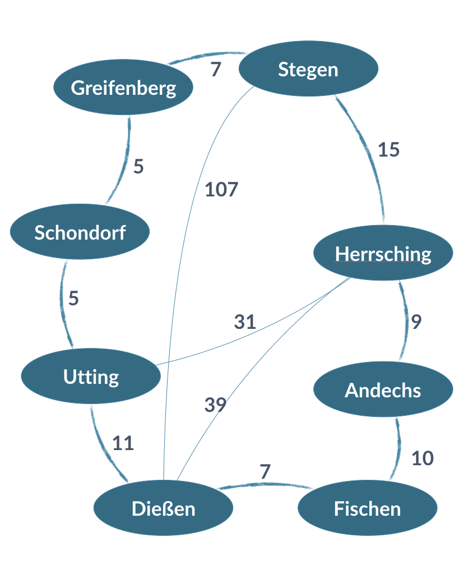

# 1. Graphen
## Aufgabe 1
Implementieren Sie einen VerweisGraph nach dem folgenden Klassendiagramm

## Aufgabe 2
Legen Sie anschließend den nachfolgenden Graphen in Ihrer Datenstruktur ab und überprüfen Sie die Korrektheit.
