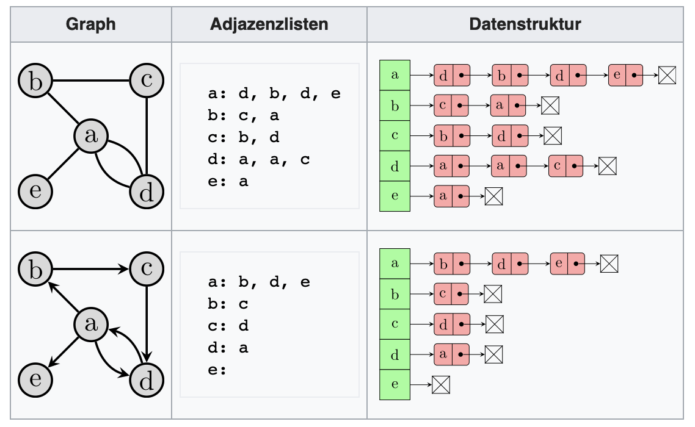

# 2. Graphen mit Adjazenzlisten
In der Graphentheorie sind Adjazenzlisten (oder auch Nachbarschaftslisten) eine Möglichkeit, Graphen zu repräsentieren. 
Dabei wird für jeden Knoten eine Liste, die Adjazenzliste, aller seiner Nachbarn (in ungerichteten Graphen) bzw.
Nachfolger (in gerichteten Graphen) angegeben. Oft basieren Datenstrukturen für Graphen auf Adjazenzlisten.
Im einfachsten Fall wird in einem Array für jeden Knoten eine einfach verkettete Liste aller Nachbarn gespeichert.

[Informationen zur Adjazenzliste und Adjazenzmatrix](https://www.youtube.com/watch?v=Pw4aeb_UMOo)

## Aufgabe 1
Implementieren Sie einen Adjazenzlistengraph 
Als Unterstützung gibt sind Unit-Tests implementiert.
Achtung: Die Kanten und Knoten sind weiterhin als Klassen zu implementieren. Aber sie müssen nun im Graph-Konstruktor entsprechend
in die Adjazenzlisten eingebaut werden.

## Aufgabe 3
Schreiben Sie Methoden für die folgenden Funktionen der Klasse `Graph

1. `sucheKnoten(knoten : Knoten) : Boolean`
   Sucht eines Knoten (meldet, ob ein Knoten im Graph vorhanden ist)

2. `fun sucheKnoten(knoten : String) : Boolean`
   Sucht eines Knoten (meldet, ob ein Knoten im Graph vorhanden ist)
   
3. `fun gibNachbarnFuer(knoten : Knoten) : List<Knoten>`
   Suche von Nachbarn (meldet alle Nachbarn eines bestimmten Knotens)

4. `fun gibNachbarnFuer(knoten : String) : List<Knoten>`
   Suche von Nachbarn (meldet alle Nachbarn eines bestimmten Knotens)
   
6. `fun gibEntfernungZwischen(start : Knoten, ziel: Knoten) : Int`
   Berechnung der Entfernung (übernimmt 2 *direkt benachbarte* Knoten und gibt deren Entfernung aus).
   Soll `Int.MAX_VALUE` zurück geben, falls keine direkte Verbindung besteht