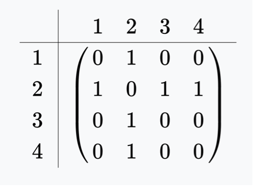
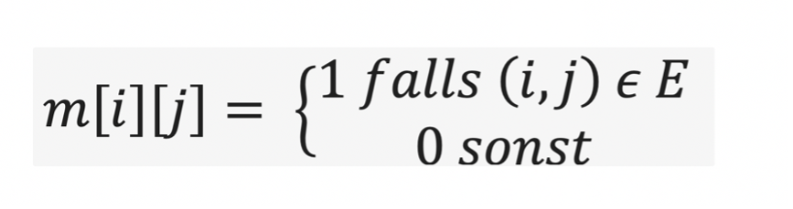
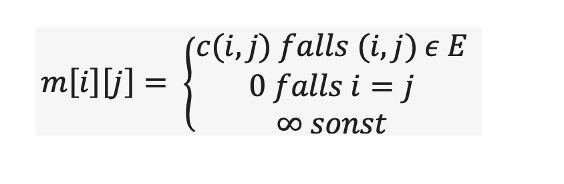

# 3. Graphen mit Adjazenzmatrizen
Die Adjazenzmatrix eines Graphen ist eine quadratische Matrix (Tabelle), deren Anzahl an Spalten bzw. Zeilen mit der Anzahl der Knoten des Graphen übereinstimmt. 
Die Einträge in den Zellen der Matrix geben wieder, ob zwischen zwei Knoten eine Kante existiert und welche Bewertung diese gegebenenfalls hat.


Die Werte der Matrix berechnen sich wie folgt (i: Spalten, j: Zeilen)





[Informationen zur Adjazenzliste und Adjazenzmatrix](https://www.youtube.com/watch?v=Pw4aeb_UMOo)


Die Adjazenzmatrix wird einfach durch ein zweidimensionales Array realisiert. Als Datentyp wählt man den Datentyp der gespeicherten Kantengewichte. 
Ein zweidimensionales Array ist einfach ein Array von Arrays. Hier am Beispiel eines 2-dimensionalen Int-Arrays.

Hier ein Beispiel für die Erzeugung eines zweidimensionalen Integer-Arrays
```
fun main() {
    val array2D = Array(10, {IntArray(10) {Integer.MAX_VALUE}})
    array2D[0][0] = 1
    array2D[0][1] = 2
    array2D[0][2] = 3
    array2D[1][0] = 4
    array2D[2][0] = 5
    array2D[2][4] = 6
   
    array2D.forEach { 
        it.forEach {print("$it ")}
        println("")
    }
    
}
```
## Aufgabe 1
Implementieren Sie einen Adjazenzmatrizen-Graphen 
Als Unterstützung gibt sind Unit-Tests implementiert:


## Aufgabe 3
Schreiben Sie Methoden für die folgenden Funktionen der Klasse `Graph

1. `sucheKnoten(knoten : Knoten) : Boolean`
   Sucht eines Knoten (meldet, ob ein Knoten im Graph vorhanden ist)

2. `fun sucheKnoten(knoten : String) : Boolean`
   Sucht eines Knoten (meldet, ob ein Knoten im Graph vorhanden ist)
   
3. `fun gibNachbarnFuer(knoten : Knoten) : List<Knoten>`
   Suche von Nachbarn (meldet alle Nachbarn eines bestimmten Knotens)

4. `fun gibNachbarnFuer(knoten : String) : List<Knoten>`
   Suche von Nachbarn (meldet alle Nachbarn eines bestimmten Knotens)
   
6. `fun gibEntfernungZwischen(start : Knoten, ziel: Knoten) : Int`
   Berechnung der Entfernung (übernimmt 2 *direkt benachbarte* Knoten und gibt deren Entfernung aus).
   Soll `Int.MAX_VALUE` zurück geben, falls keine direkte Verbindung besteht